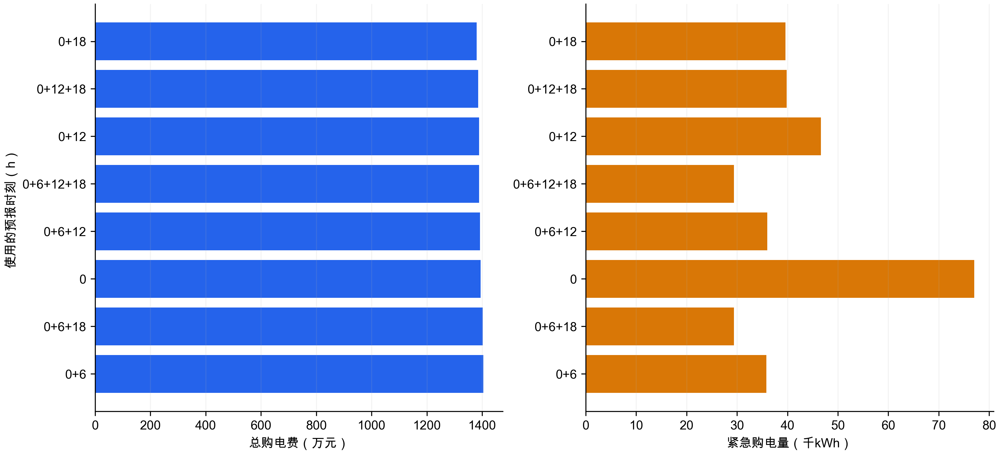
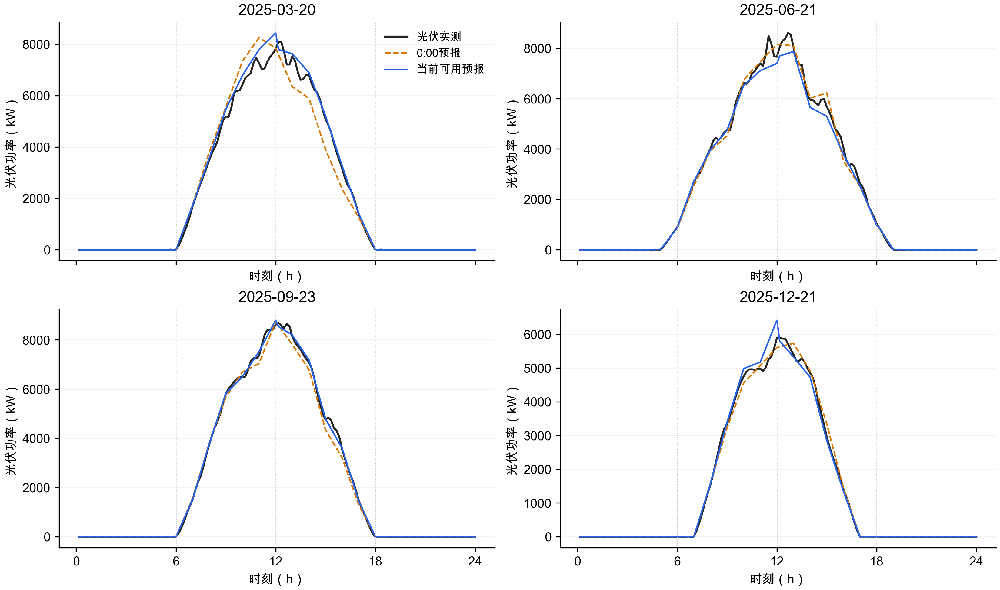
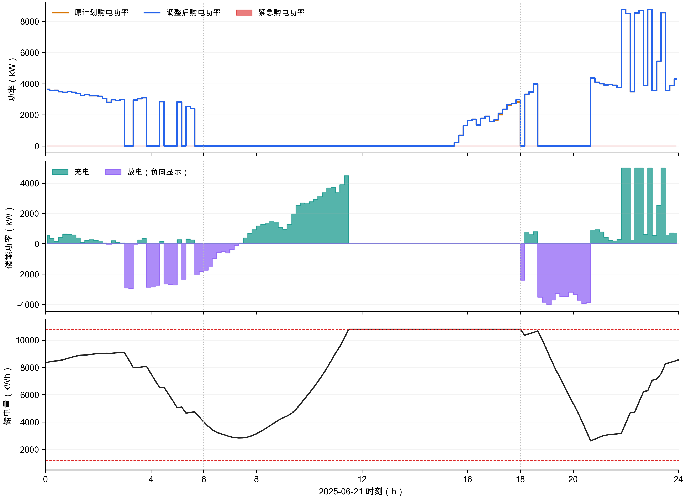

# 问题3结果报告

本次新增求解：附件3因果预报驱动的24小时滚动MILP及实际运行回放。正式统计区间为2025年2月1日至12月31日，共334天。模型公式、假设与复现步骤见上一级《建模笔记.md》。

## 1. 主方案结果

| 指标 | 数值 |
|---|---|
| 计划购电费（元） | 13,461,929.89 |
| 调整相关费用（元） | 256,551.71 |
| 紧急购电费（元） | 173,776.57 |
| 总购电费（元） | 13,892,258.17 |
| 紧急购电量（kWh） | 29,380.23 |
| 上调购电量（kWh） | 245,470.53 |
| 2月1日初始储电量（kWh） | 7,827.28 |
| 12月31日结束储电量（kWh） | 6,213.98 |

费用按原计划全额结算，再加上调1.5倍电价、下调0.5倍违约费和实际紧急购电5倍电价；调整量以最终生效值与0:00原计划之差计算，每个执行时段只结算一次。

## 2. 是否需要日内预报

下列8种固定时刻组合使用相同负载预测、相同风险参数、相同2月1日实际初始储电量。结论仅适用于该模型、执行规则和数据，不是对所有策略的最优性证明。

| 预报时刻 | 总费用（元） | 紧急购电（kWh） | 调整费用（元） | 年末储电量（kWh） |
|---|---|---|---|---|
| 0+6 | 14,045,852.81 | 35,811.32 | 365,392.30 | 6,213.98 |
| 0+6+18 | 14,019,051.12 | 29,414.73 | 383,438.24 | 6,213.98 |
| 0 | 13,948,842.11 | 77,004.88 | 0.00 | 6,213.98 |
| 0+6+12 | 13,921,056.08 | 36,020.38 | 239,661.30 | 6,213.98 |
| 0+6+12+18 | 13,892,258.17 | 29,380.23 | 256,551.71 | 6,213.98 |
| 0+12 | 13,885,400.21 | 46,640.71 | 151,281.03 | 6,213.98 |
| 0+12+18 | 13,855,957.58 | 39,821.67 | 168,834.99 | 6,213.98 |
| 0+18 | 13,802,060.57 | 39,596.86 | 119,291.14 | 6,213.98 |

四次预报方案相对仅0:00方案，费用减少56,583.94元（0.41%）。

不能预先断言预报越新，所有时段误差就必然更小。以下在完全相同的目标时段比较0:00预报与新预报：

| 更新时刻 | 预报版本 | 相同目标点数 | MAE（kW） | RMSE（kW） |
|---|---|---|---|---|
| 6 | midnight | 36072 | 259.80 | 441.56 |
| 6 | updated | 36072 | 158.52 | 271.37 |
| 12 | midnight | 24048 | 218.45 | 418.35 |
| 12 | updated | 24048 | 75.25 | 139.73 |
| 18 | midnight | 12024 | 10.62 | 46.24 |
| 18 | updated | 12024 | 10.02 | 42.92 |

## 3. 指定日期的表1、表2、表3

表1列出原计划、调整后及紧急购电量，防止把调整后购电量误写为调整增量。所有电量单位为kWh，费用单位为元。表2使用实际执行的储能轨迹。

### 2025-03-20

表1 指定时间段购电量

| 时间段 | 原计划购电量 | 调整后购电量 | 紧急购电量 |
|---|---|---|---|
| 10:00-10:10 | 0.00 | 0.00 | 0.00 |
| 12:00-12:10 | 634.57 | 634.57 | 0.00 |
| 14:00-14:10 | 0.00 | 0.00 | 0.00 |
| 16:00-16:10 | 680.22 | 680.22 | 0.00 |
| 18:00-18:10 | 700.81 | 700.81 | 0.00 |
| 20:00-20:10 | 0.00 | 0.00 | 0.00 |

全天原计划购电量 70,640.00；调整后购电量 70,994.15；紧急购电量 233.04。计划费 43,131.97；调整费 419.17；紧急费 1,152.33；总费 44,703.47。

表2 储能充放电量

| 时间段 | 充电量 | 放电量 |
|---|---|---|
| 00:00-04:00 | 4,109.70 | 202.02 |
| 04:00-08:00 | 958.45 | 6,097.61 |
| 08:00-12:00 | 5,844.00 | 2,554.20 |
| 12:00-16:00 | 5,137.14 | 254.72 |
| 16:00-20:00 | 3.42 | 5,722.42 |
| 20:00-24:00 | 5,575.74 | 2,972.49 |

0:00储电量 6,476.26；24:00储电量 6,160.23。

表3 紧急购电结果

| 紧急购电时间段 | 紧急购电量 |
|---|---|
| 09:10-10:00 | 223.17 |
| 20:30-20:40 | 9.86 |

### 2025-06-21

表1 指定时间段购电量

| 时间段 | 原计划购电量 | 调整后购电量 | 紧急购电量 |
|---|---|---|---|
| 10:00-10:10 | 0.00 | 0.00 | 0.00 |
| 12:00-12:10 | 0.00 | 0.00 | 0.00 |
| 14:00-14:10 | 0.00 | 0.00 | 0.00 |
| 16:00-16:10 | 274.80 | 274.80 | 0.00 |
| 18:00-18:10 | 0.00 | 0.00 | 0.00 |
| 20:00-20:10 | 0.00 | 0.00 | 0.00 |

全天原计划购电量 37,306.50；调整后购电量 37,354.87；紧急购电量 0.00。计划费 22,193.64；调整费 79.25；紧急费 0.00；总费 22,272.89。

表2 储能充放电量

| 时间段 | 充电量 | 放电量 |
|---|---|---|
| 00:00-04:00 | 955.47 | 1,464.04 |
| 04:00-08:00 | 512.14 | 4,390.39 |
| 08:00-12:00 | 8,510.99 | 0.00 |
| 12:00-16:00 | 0.00 | 0.00 |
| 16:00-20:00 | 350.04 | 5,157.72 |
| 20:00-24:00 | 6,586.22 | 2,485.90 |

0:00储电量 8,324.18；24:00储电量 8,549.72。

表3 紧急购电结果

当日无紧急购电。

### 2025-09-23

表1 指定时间段购电量

| 时间段 | 原计划购电量 | 调整后购电量 | 紧急购电量 |
|---|---|---|---|
| 10:00-10:10 | 0.00 | 0.00 | 0.00 |
| 12:00-12:10 | 445.42 | 445.42 | 0.00 |
| 14:00-14:10 | 0.00 | 0.00 | 0.00 |
| 16:00-16:10 | 621.80 | 621.80 | 0.00 |
| 18:00-18:10 | 789.09 | 789.09 | 0.00 |
| 20:00-20:10 | 0.00 | 0.00 | 0.00 |

全天原计划购电量 73,888.54；调整后购电量 73,888.54；紧急购电量 55.45。计划费 46,053.99；调整费 0.00；紧急费 292.47；总费 46,346.46。

表2 储能充放电量

| 时间段 | 充电量 | 放电量 |
|---|---|---|
| 00:00-04:00 | 4,817.74 | 39.18 |
| 04:00-08:00 | 772.25 | 5,615.81 |
| 08:00-12:00 | 6,293.08 | 1,896.62 |
| 12:00-16:00 | 3,325.13 | 403.62 |
| 16:00-20:00 | 0.00 | 5,618.15 |
| 20:00-24:00 | 5,681.74 | 3,062.53 |

0:00储电量 5,951.77；24:00储电量 6,268.37。

表3 紧急购电结果

| 紧急购电时间段 | 紧急购电量 |
|---|---|
| 20:20-20:40 | 15.25 |
| 20:50-21:00 | 40.20 |

### 2025-12-21

表1 指定时间段购电量

| 时间段 | 原计划购电量 | 调整后购电量 | 紧急购电量 |
|---|---|---|---|
| 10:00-10:10 | 0.00 | 0.00 | 0.00 |
| 12:00-12:10 | 1,043.53 | 1,043.53 | 0.00 |
| 14:00-14:10 | 0.00 | 0.00 | 0.00 |
| 16:00-16:10 | 874.33 | 874.33 | 0.00 |
| 18:00-18:10 | 739.71 | 739.71 | 0.00 |
| 20:00-20:10 | 0.00 | 0.00 | 0.00 |

全天原计划购电量 98,882.56；调整后购电量 98,897.32；紧急购电量 0.00。计划费 63,579.01；调整费 19.68；紧急费 0.00；总费 63,598.69。

表2 储能充放电量

| 时间段 | 充电量 | 放电量 |
|---|---|---|
| 00:00-04:00 | 4,360.40 | 96.41 |
| 04:00-08:00 | 1,111.39 | 1,456.61 |
| 08:00-12:00 | 6,218.99 | 6,975.67 |
| 12:00-16:00 | 6,219.49 | 2,302.04 |
| 16:00-20:00 | 0.00 | 5,580.76 |
| 20:00-24:00 | 5,710.33 | 2,842.53 |

0:00储电量 6,714.90；24:00储电量 6,580.09。

表3 紧急购电结果

当日无紧急购电。

## 4. 参数敏感性与局限

风险分位数0.8、终端参考储电量6000kWh是在对照实验前固定的主方案参数。下列为敏感性分析，未根据全年的测试结果回选参数。0表示不加误差缓冲，并非使用0分位数。

| 风险分位数 | 规划终端参考（kWh） | 总费用（元） | 紧急购电（kWh） | 实际年末储电（kWh） |
|---|---|---|---|---|
| 0.80 | 6,000.00 | 13,892,258.17 | 29,380.23 | 6,213.98 |
| 0.00 | 6,000.00 | 13,758,289.74 | 150,045.76 | 5,843.94 |
| 0.70 | 6,000.00 | 13,632,047.90 | 47,369.35 | 6,047.88 |
| 0.90 | 6,000.00 | 14,447,688.15 | 13,400.27 | 6,451.61 |
| 0.80 | 3,600.00 | 13,872,714.11 | 29,396.76 | 3,887.23 |
| 0.80 | 8,400.00 | 13,919,044.76 | 29,348.96 | 8,563.01 |

1. 滚动MILP求解的是当前信息下的确定性风险缓冲近似；并非带完整场景树的多阶段随机规划。求解器的最优间隙不能解释成全年随机运行成本的最优间隙。
2. 实际储能执行采用当前余电优先充电、缺口优先放电、剩余缺口紧急购电的因果规则。规划储能轨迹与实际轨迹可不同，后续滚动用真实SOC纠正。该规则未对每10分钟的未来应急价值再优化，是进一步改进方向。
3. 日内滚动窗口跨到次日时，次日负载暂用当前日已发布的24小时负载曲线同钟点延拓；次日购电量只是内部展望，实际到次日0:00重新制定和计费。
4. 风险缓冲用过去28天同发布时间、同提前时距的净负荷误差，0.8不等于全年80%的联合供电保证；没有假设误差正态。
5. 终端储电量参考值是建模参数，题面仅第一问要求首末储电量相等。第三问不重置日初SOC。1月用于连续运行热启动，已将2月1日初始状态列出。
6. 结算采用题面字面口径：计划费不退、下调另付违约费。这使下调被保留原量并弃余电支配，因此本方案下调量为零。若比赛方另有退款解释，必须统一更改目标函数及费用复核后重算。

## 5. 输出口径和复核

result3.xlsx保留官方四张工作表。计划表保存0:00原计划；调整表保存每个时段最终生效的购电量（包括未调整时段的原值），最后一列明确为调整相关费用；充放电表为实际执行量；紧急表合并同一天内连续的紧急时段。

原模板的144个时段表头从0:10-0:20开始，末尾为次日0:00-0:10，与题目整日及主表不一致。仅输出副本将表头改为00:00-00:10至23:50-24:00，数值按日期+slot写入，原附件不改。

数值平衡、效率、SOC边界与跨日连续、信息时点、计划量结算、调整量结算、Excel逐格映射均由verify_q3.py独立检查，检查结果见problem3_verification.json。

完整预报误差按发布时间和提前时距分组保存在problem3_forecast_metrics.csv；所有滚动窗口（含次日未执行展望）保存在problem3_rolling_windows.csv.gz。
