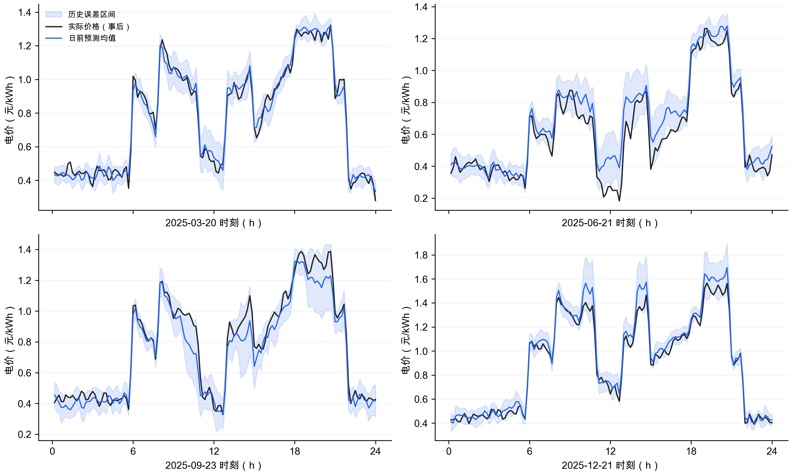
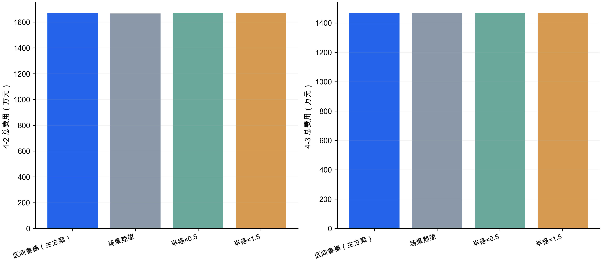
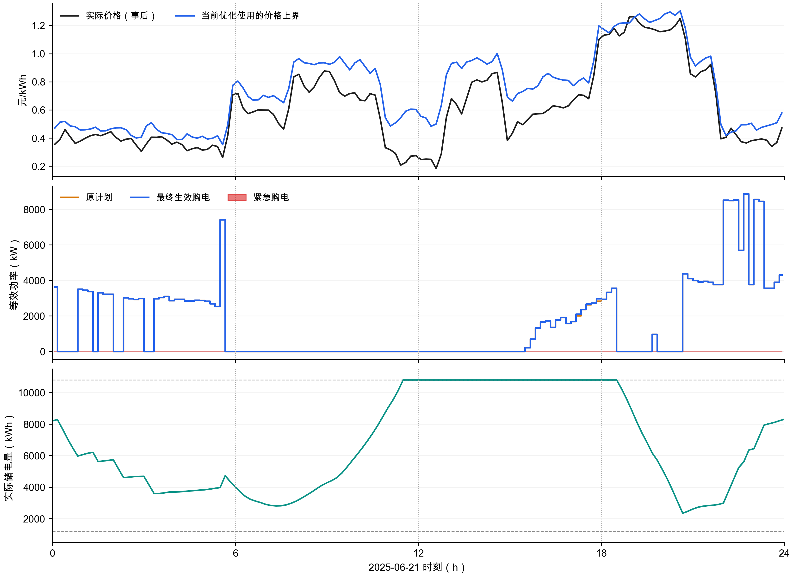

# 第四问结果与论文素材

本次新增求解：因果电价预测、历史误差场景、区间鲁棒MILP、全年执行回放和官方结果表。统计期为2025年2月1日至12月31日（334天）；1月只做选择/热启动。公式、信息假设和复现入口见上一级《建模笔记.md》。

## 1. 主方案结果

| 指标 | 4-2 | 4-3 |
|---|---|---|
| 原计划费用（元） | 12,695,697.74 | 14,223,775.09 |
| 调整费用（元） | 0.00 | 273,450.49 |
| 紧急购电费（元） | 3,992,528.58 | 164,521.67 |
| 总费用（元） | 16,688,226.32 | 14,661,747.24 |
| 紧急购电量（kWh） | 622,309.15 | 27,857.77 |
| 上调购电量（kWh） | 0.00 | 246,134.61 |
| 2月1日初始储电（kWh） | 6,135.56 | 7,823.29 |
| 年末实际储电（kWh） | 5,826.48 | 6,185.02 |

4-2保持第二问日前计划和历史光伏预测；4-3保持第三问附件3预报与0、6、12、18时滚动更新。二者的预测信息、风险缓冲和热启动结果均不同，不能把费用差额全解释为MPC本身的作用。计划费按计划量结算，不按实际使用量减免。所有方案实际费用均逐日逐时使用附件4电价。

## 2. 电价预测与区间检验

仅在1月15—31日滚动验证中选择预测模型，2月起冻结为前7天/前14天同钟点平均；未用全年测试集选模型。无未来历史时使用已观测同钟点，首日无历史时使用预设0.6元/kWh先验。日内仅用已发生的近6小时误差做衰减修正。

| 候选模型 | 1月验证MAE | 1月验证RMSE |
|---|---|---|
| weekly2 | 0.03434 | 0.04386 |
| lag7 | 0.03829 | 0.04878 |
| blend_weekly | 0.04010 | 0.05131 |
| mean7 | 0.08160 | 0.10473 |
| lag1 | 0.08576 | 0.12877 |

按发布时间和提前时距统计如下。单位为元/kWh；覆盖率是测试期逐点经验覆盖，不是24小时联合保证。

| 发布时间h | 提前时距 | MAE | RMSE | 经验覆盖率 |
|---|---|---|---|---|
| 0 | 0-6h | 0.03338 | 0.04198 | 0.85579 |
| 0 | 6-12h | 0.05048 | 0.06728 | 0.85354 |
| 0 | 12-18h | 0.05241 | 0.07009 | 0.85105 |
| 0 | 18-24h | 0.04563 | 0.06552 | 0.85155 |
| 6 | 0-6h | 0.04975 | 0.06623 | 0.85371 |
| 6 | 6-12h | 0.05203 | 0.06948 | 0.85072 |
| 6 | 12-18h | 0.04540 | 0.06512 | 0.85146 |
| 6 | 18-24h | 0.03333 | 0.04191 | 0.85644 |
| 12 | 0-6h | 0.04934 | 0.06566 | 0.85595 |
| 12 | 6-12h | 0.04466 | 0.06404 | 0.85096 |
| 12 | 12-18h | 0.03318 | 0.04174 | 0.85594 |
| 12 | 18-24h | 0.05029 | 0.06696 | 0.85444 |
| 18 | 0-6h | 0.04285 | 0.06092 | 0.85404 |
| 18 | 6-12h | 0.03279 | 0.04127 | 0.85736 |
| 18 | 12-18h | 0.05005 | 0.06664 | 0.85511 |
| 18 | 18-24h | 0.05216 | 0.06970 | 0.85194 |

整体逐点区间覆盖率为 85.37%。半径使用历史绝对偏差90%分位数，但测试覆盖率未达到90%，不能写成“90%可靠保证”。采用盒式集合还忽略了极端电价是否会同时发生，可能偏保守。

图1 指定四天的日前电价与实际电价。黑线仅用于事后评价，优化时不可见。区间可能漏掉尖峰，风险半径不代表确定的统计置信区间。

## 3. 对照实验与敏感性

每种问题内部的对照使用相同2月1日初始SOC、负载/光伏预测与执行规则。主参数半径倍率1在测试前固定，未看测试结果后挑选。场景期望模型共享同一个决策向量，其线性目标等价于用场景均价求解；不是完整多阶段随机场景树。

### 4-2

| 策略 | 总费用（元） | 紧急购电（kWh） | 最贵5%日期均费（元） | 年末SOC（kWh） |
|---|---|---|---|---|
| 区间鲁棒（主方案） | 16,688,226.32 | 622,309.15 | 112,127.64 | 5,826.48 |
| 场景期望 | 16,670,307.79 | 625,443.04 | 111,214.88 | 5,832.74 |
| 半径×0.5 | 16,682,786.28 | 624,563.19 | 111,913.13 | 5,827.68 |
| 半径×1.5 | 16,702,469.61 | 620,823.96 | 112,425.09 | 5,854.87 |
| 固定电价制定计划 | 16,692,031.48 | 626,074.25 | 110,428.98 | 5,805.58 |
| 提前知道真实价格（不可部署） | 16,648,961.89 | 641,556.35 | 111,244.13 | 5,854.92 |

主方案相对场景期望的实际总费用变化：+17,918.53元（+0.11%）。此为回测结果，不预设鲁棒一定更省钱。

### 4-3

| 策略 | 总费用（元） | 紧急购电（kWh） | 最贵5%日期均费（元） | 年末SOC（kWh） |
|---|---|---|---|---|
| 区间鲁棒（主方案） | 14,661,747.24 | 27,857.77 | 76,082.68 | 6,185.02 |
| 场景期望 | 14,665,996.00 | 29,153.98 | 76,152.41 | 6,184.95 |
| 半径×0.5 | 14,660,545.79 | 28,617.75 | 76,092.46 | 6,185.02 |
| 半径×1.5 | 14,672,299.69 | 28,406.86 | 76,218.35 | 6,220.62 |
| 固定电价制定计划 | 14,667,161.87 | 29,380.23 | 76,266.92 | 6,213.98 |
| 提前知道真实价格（不可部署） | 14,536,707.96 | 30,423.34 | 75,826.27 | 6,240.48 |

主方案相对场景期望的实际总费用变化：-4,248.76元（-0.03%）。此为回测结果，不预设鲁棒一定更省钱。

“固定电价制定计划”仍按附件4真实电价结算，隔离规划价格信号的影响；它不是原第二/三问固定电价总账。“提前知道真实价格”仅为信息价值参考，不能作为可部署方案，也不是全年全策略的严格下界。不同方案年末SOC不完全相等，费用比较应结合上表末态，不能假装末态一致。最贵5%日期均费是描述性统计，不是本次优化目标中的CVaR。

图2 同一预测与执行框架内的价格风险半径对照。柱图从零开始，展示总体费用；小额差异以精确表格为准。

## 4. 指定四天的表1—表3

表1时间段使用00:00起的0基slot60、72、84、96、108、120；电量单位kWh，费用单位元。调整后购电量不是调整增量。表2是实际执行值，不是优化器尚未执行的规划轨迹。

### 4-2 指定日期

#### 2025-03-20

表1 购电量

| 时间段 | 原计划 | 最终生效购电 | 紧急购电 |
|---|---|---|---|
| 10:00-10:10 | 0.00 | 0.00 | 0.00 |
| 12:00-12:10 | 527.28 | 527.28 | 0.00 |
| 14:00-14:10 | 0.00 | 0.00 | 0.00 |
| 16:00-16:10 | 499.35 | 499.35 | 0.00 |
| 18:00-18:10 | 0.00 | 0.00 | 0.00 |
| 20:00-20:10 | 723.37 | 723.37 | 0.00 |

全天计划量 64,178.47；最终生效量 64,178.47；紧急量 1,984.22。计划费 39,704.14；调整费 0.00；紧急费 12,580.39；总费 52,284.53。

表2 储能电量

| 时间段 | 充电量 | 放电量 |
|---|---|---|
| 00:00-04:00 | 5,187.77 | 254.81 |
| 04:00-08:00 | 197.28 | 5,660.98 |
| 08:00-12:00 | 4,753.89 | 2,777.38 |
| 12:00-16:00 | 4,526.60 | 565.99 |
| 16:00-20:00 | 110.03 | 6,802.18 |
| 20:00-24:00 | 5,373.60 | 320.73 |

0:00储电 6,073.00；24:00储电 6,004.94。

表3 紧急购电

| 连续紧急时间段 | 紧急购电量 |
|---|---|
| 20:10-20:40 | 1,914.29 |
| 21:20-21:50 | 69.93 |

#### 2025-06-21

表1 购电量

| 时间段 | 原计划 | 最终生效购电 | 紧急购电 |
|---|---|---|---|
| 10:00-10:10 | 0.00 | 0.00 | 0.00 |
| 12:00-12:10 | 0.00 | 0.00 | 0.00 |
| 14:00-14:10 | 0.00 | 0.00 | 0.00 |
| 16:00-16:10 | 177.62 | 177.62 | 0.00 |
| 18:00-18:10 | 92.85 | 92.85 | 0.00 |
| 20:00-20:10 | 0.00 | 0.00 | 0.00 |

全天计划量 34,064.39；最终生效量 34,064.39；紧急量 170.62。计划费 16,646.26；调整费 0.00；紧急费 507.32；总费 17,153.58。

表2 储能电量

| 时间段 | 充电量 | 放电量 |
|---|---|---|
| 00:00-04:00 | 160.42 | 3,444.36 |
| 04:00-08:00 | 1,183.57 | 1,581.54 |
| 08:00-12:00 | 10,322.21 | 0.00 |
| 12:00-16:00 | 0.00 | 0.00 |
| 16:00-20:00 | 29.41 | 6,095.12 |
| 20:00-24:00 | 5,608.30 | 2,583.90 |

0:00储电 5,884.75；24:00储电 6,230.59。

表3 紧急购电

| 连续紧急时间段 | 紧急购电量 |
|---|---|
| 06:50-07:20 | 170.62 |

#### 2025-09-23

表1 购电量

| 时间段 | 原计划 | 最终生效购电 | 紧急购电 |
|---|---|---|---|
| 10:00-10:10 | 0.00 | 0.00 | 0.00 |
| 12:00-12:10 | 413.45 | 413.45 | 0.00 |
| 14:00-14:10 | 0.00 | 0.00 | 0.00 |
| 16:00-16:10 | 518.23 | 518.23 | 0.00 |
| 18:00-18:10 | 0.00 | 0.00 | 0.00 |
| 20:00-20:10 | 0.00 | 0.00 | 0.00 |

全天计划量 64,455.75；最终生效量 64,455.75；紧急量 2,493.03。计划费 41,778.16；调整费 0.00；紧急费 16,464.75；总费 58,242.92。

表2 储能电量

| 时间段 | 充电量 | 放电量 |
|---|---|---|
| 00:00-04:00 | 4,915.66 | 35.85 |
| 04:00-08:00 | 702.54 | 7,029.91 |
| 08:00-12:00 | 4,075.38 | 1,687.49 |
| 12:00-16:00 | 5,473.90 | 786.67 |
| 16:00-20:00 | 95.68 | 5,936.80 |
| 20:00-24:00 | 5,589.48 | 1,119.59 |

0:00储电 5,865.69；24:00储电 6,192.72。

表3 紧急购电

| 连续紧急时间段 | 紧急购电量 |
|---|---|
| 09:00-09:50 | 209.12 |
| 18:20-18:30 | 1.08 |
| 20:10-21:00 | 2,282.83 |

#### 2025-12-21

表1 购电量

| 时间段 | 原计划 | 最终生效购电 | 紧急购电 |
|---|---|---|---|
| 10:00-10:10 | 0.00 | 0.00 | 0.00 |
| 12:00-12:10 | 910.67 | 910.67 | 0.00 |
| 14:00-14:10 | 0.00 | 0.00 | 0.00 |
| 16:00-16:10 | 809.39 | 809.39 | 0.00 |
| 18:00-18:10 | 719.05 | 719.05 | 0.00 |
| 20:00-20:10 | 0.00 | 0.00 | 0.00 |

全天计划量 92,665.59；最终生效量 92,665.59；紧急量 1,393.40。计划费 69,020.16；调整费 0.00；紧急费 9,382.74；总费 78,402.90。

表2 储能电量

| 时间段 | 充电量 | 放电量 |
|---|---|---|
| 00:00-04:00 | 5,578.05 | 305.38 |
| 04:00-08:00 | 943.89 | 1,770.73 |
| 08:00-12:00 | 5,190.01 | 7,485.15 |
| 12:00-16:00 | 7,818.51 | 2,711.49 |
| 16:00-20:00 | 64.56 | 5,290.13 |
| 20:00-24:00 | 5,394.71 | 2,603.77 |

0:00储电 5,905.01；24:00储电 5,988.38。

表3 紧急购电

| 连续紧急时间段 | 紧急购电量 |
|---|---|
| 10:30-10:50 | 481.09 |
| 20:30-20:50 | 912.31 |

### 4-3 指定日期

#### 2025-03-20

表1 购电量

| 时间段 | 原计划 | 最终生效购电 | 紧急购电 |
|---|---|---|---|
| 10:00-10:10 | 0.00 | 0.00 | 0.00 |
| 12:00-12:10 | 634.57 | 634.57 | 0.00 |
| 14:00-14:10 | 0.00 | 0.00 | 0.00 |
| 16:00-16:10 | 680.22 | 680.22 | 0.00 |
| 18:00-18:10 | 111.58 | 111.58 | 0.00 |
| 20:00-20:10 | 728.51 | 728.51 | 0.00 |

全天计划量 70,428.51；最终生效量 70,428.51；紧急量 0.00。计划费 44,347.31；调整费 0.00；紧急费 0.00；总费 44,347.31。

表2 储能电量

| 时间段 | 充电量 | 放电量 |
|---|---|---|
| 00:00-04:00 | 4,770.08 | 161.76 |
| 04:00-08:00 | 192.34 | 5,648.91 |
| 08:00-12:00 | 5,129.48 | 2,777.38 |
| 12:00-16:00 | 5,550.82 | 254.72 |
| 16:00-20:00 | 0.00 | 6,403.02 |
| 20:00-24:00 | 5,597.48 | 2,224.22 |

0:00储电 6,546.85；24:00储电 6,251.91。

表3 紧急购电

无。

#### 2025-06-21

表1 购电量

| 时间段 | 原计划 | 最终生效购电 | 紧急购电 |
|---|---|---|---|
| 10:00-10:10 | 0.00 | 0.00 | 0.00 |
| 12:00-12:10 | 0.00 | 0.00 | 0.00 |
| 14:00-14:10 | 0.00 | 0.00 | 0.00 |
| 16:00-16:10 | 274.80 | 274.80 | 0.00 |
| 18:00-18:10 | 489.26 | 489.26 | 0.00 |
| 20:00-20:10 | 0.00 | 0.00 | 0.00 |

全天计划量 37,574.15；最终生效量 37,623.44；紧急量 0.00。计划费 19,508.33；调整费 65.76；紧急费 0.00；总费 19,574.09。

表2 储能电量

| 时间段 | 充电量 | 放电量 |
|---|---|---|
| 00:00-04:00 | 671.43 | 4,604.58 |
| 04:00-08:00 | 1,491.46 | 1,719.95 |
| 08:00-12:00 | 8,531.04 | 0.00 |
| 12:00-16:00 | 0.00 | 0.00 |
| 16:00-20:00 | 0.00 | 5,124.36 |
| 20:00-24:00 | 6,626.85 | 2,485.90 |

0:00储电 8,202.71；24:00储电 8,308.33。

表3 紧急购电

无。

#### 2025-09-23

表1 购电量

| 时间段 | 原计划 | 最终生效购电 | 紧急购电 |
|---|---|---|---|
| 10:00-10:10 | 0.00 | 0.00 | 0.00 |
| 12:00-12:10 | 445.42 | 445.42 | 0.00 |
| 14:00-14:10 | 0.00 | 0.00 | 0.00 |
| 16:00-16:10 | 621.80 | 621.80 | 0.00 |
| 18:00-18:10 | 0.00 | 0.00 | 0.00 |
| 20:00-20:10 | 0.00 | 0.00 | 0.00 |

全天计划量 73,668.20；最终生效量 73,668.28；紧急量 16.61。计划费 48,088.44；调整费 0.17；紧急费 110.35；总费 48,198.96。

表2 储能电量

| 时间段 | 充电量 | 放电量 |
|---|---|---|
| 00:00-04:00 | 4,735.79 | 26.90 |
| 04:00-08:00 | 621.48 | 5,524.51 |
| 08:00-12:00 | 6,293.08 | 1,896.62 |
| 12:00-16:00 | 3,227.51 | 403.62 |
| 16:00-20:00 | 108.90 | 5,367.89 |
| 20:00-24:00 | 5,703.28 | 3,338.99 |

0:00储电 6,133.98；24:00储电 6,356.65。

表3 紧急购电

| 连续紧急时间段 | 紧急购电量 |
|---|---|
| 20:10-20:30 | 16.61 |

#### 2025-12-21

表1 购电量

| 时间段 | 原计划 | 最终生效购电 | 紧急购电 |
|---|---|---|---|
| 10:00-10:10 | 0.00 | 0.00 | 0.00 |
| 12:00-12:10 | 1,043.53 | 1,043.53 | 0.00 |
| 14:00-14:10 | 0.00 | 0.00 | 0.00 |
| 16:00-16:10 | 874.33 | 874.33 | 0.00 |
| 18:00-18:10 | 739.71 | 739.71 | 0.00 |
| 20:00-20:10 | 0.00 | 0.00 | 0.00 |

全天计划量 99,008.50；最终生效量 99,023.26；紧急量 0.00。计划费 74,908.92；调整费 22.97；紧急费 0.00；总费 74,931.89。

表2 储能电量

| 时间段 | 充电量 | 放电量 |
|---|---|---|
| 00:00-04:00 | 4,646.03 | 96.41 |
| 04:00-08:00 | 837.11 | 1,420.71 |
| 08:00-12:00 | 6,113.67 | 6,870.34 |
| 12:00-16:00 | 6,514.42 | 2,560.95 |
| 16:00-20:00 | 0.00 | 5,171.86 |
| 20:00-24:00 | 5,684.53 | 3,237.08 |

0:00储电 6,664.78；24:00储电 6,572.81。

表3 紧急购电

无。

图3 6月21日价格信号、购电计划和真实储能状态。竖线是日内更新点；计划变量kWh乘6仅为图中等效kW显示，不改变结算量。

## 5. 已完成校验与使用边界

独立校验见problem4_verification.json：改变未来电价不改变已发布预测；1月模型选择不受2—12月价格扰动；逐时费用使用对应日期实际价格；表格逐格一致；SOC连续、效率、功率上限、互斥和≥平衡满足。Excel公式经重算和两天的真实输入扰动测试，导出副本修正官方模板晚10分钟的表头，原附件未变。

本方案为“价格风险缓冲＋滚动确定性MILP＋因果执行”的可复现实验，不是全年随机控制全局最优解。未来电价不可知是参考截图采用的建模假设，而不是题面明示的发布机制。价格场景未同时优化光伏/负载联合分布；实时储能采用余电先充、缺口先放规则，规划与实际轨迹可不同。4-2每日规划终态6000、4-3窗口规划终态至少6000是继承的工程约束，不重置实际SOC。

论文可用的结论：在上述信息与结算假设下，滚动方案减少了本实验的紧急缺口，但盒式电价鲁棒不保证优于期望价格策略。保留实际差异、区间欠覆盖、末态差异等限制，比只宣称“更鲁棒所以更便宜”更符合数据。
